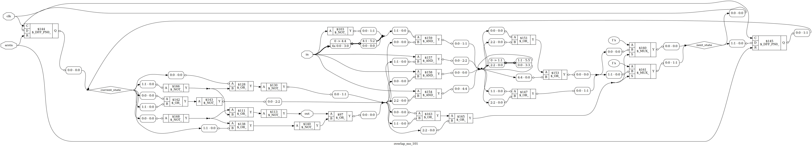

# Sequence Detector (101) in SystemVerilog

## 1. Overview
This repository contains synthesizable Sequence Detector designed using a **Moore Finite State Machine (FSM)**. The design detects the overlapping sequence `101` 

## 2. Design Specification
| Feature | Implementation |
| :--- | :--- |
| **FSM Type** | Moore (Output depends on State only) |
| **Sequence** | 101 (Overlapping) |
| **Reset** | Asynchronous, Active-Low |

## 3. Architecture
The design utilizes a 4-state FSM. A Mealy machine was chosen over Moore to achieve a 1-clock cycle reduction in output latency.

## 4. Verification & Simulation
Verification was performed using a simple self-checking SystemVerilog testbench. 
- **Tool:** Modelsim
- **Test Scenarios:** Reset behavior, overlapping sequence detection

## 5. Synthesis Results (Yosys)
Synthesis was performed using the **Yosys Open Synthesis Suite** targeting the generic cell library.

